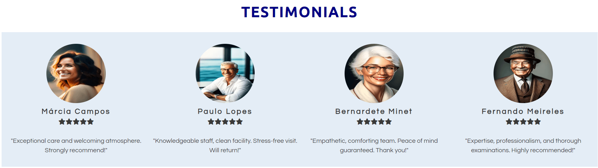
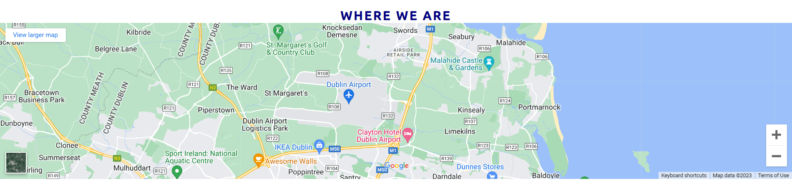

# CheckUp Dublin Center

Welcome to the CheckUp Dublin Center repository! This website serves as an immersive online platform dedicated to delivering essential health information and services to the residents of Dublin.

The goal of the CheckUp Dublin Center website is to provide a virtual clinic experience that offers a thorough health screening checkup, with a focus on preventive medicine. This checkup includes a full physical examination, various medical tests, and advanced exams, all conveniently available at a single location. Our primary aim is to prioritize the well-being and health of our patients by providing a comprehensive and convenient healthcare solution. 

## Design

### Color Scheme

The choice of colors plays a crucial role in shaping the overall perception of professionalism, trustworthiness, and clarity when creating a website for CheckUp Dublin Center.

The gentle blues establish an atmosphere of calmness and hospitality, while the grays and deeper blues introduce contrast and structure.

The color palette was created using the [Coolors](https://coolors.co/) website.

### Typography

Google Fonts was used for the following fonts: 

- Ubuntu for Titles:
  -  Sans-serif font
  -  Professional and modern appearance

- Questrial for Body:
  -  Sans-serif font
  -  Clean and elegant design, that provides pleasant reading experience

### Imagery

The website features a captivating array of imagery sourced from iStock, Lexica, and Unsplash, offering a diverse selection of high-quality visuals. To honor the sources of these remarkable images, proper credits have been given in the dedicated [credits](#Credits) section.

## Features 

The website consists of five pages, with four of them accessible through the navigation menu: the home page, the about CheckUp Dublin Center page, the services page, and the contact us page. The fifth page is a thank you page that appears after a user submits the form on the contact us page.

### Existing Features

Every page on the website has:

- __Navigation Bar__

  - At the top of the website, there is a fully responsive navigation bar that is featured on all four pages. It includes links to the Logo, Home page, About CheckUp Dublin Center, Services, and Contact us page. It remains consistent across all pages, making navigation effortless.
  - This section enables users to navigate easily between pages on all devices without the need to rely on the 'back' button to go to the previous page. 

- __Footer__ 

  - The footer section includes links to the relevant social media sites for CheckUp Dublin Center. The links will open in a new tab, providing a seamless navigation experience for the user. 
  - Icons were used to maintain a clean footer and because they are universally recognizable.

#### Home page

- __The landing page image__

  - The landing page features a captivating background image with overlaid text showcasing a detailed view of a stethoscope alongside a digital tablet exhibiting a virtual electronic medical record interface. This imagery signifies the harmonious fusion of technology and healthcare, underscoring our dedication to providing state-of-the-art medical services to our valued patients. By using the stethoscope as a symbol of traditional medical expertise and the digital tablet as a depiction of our modern tools and systems, we aim to blend the most exceptional elements from both domains, providing a comprehensive patient experience that addresses their overall well-being.
  - This section additionally captivates the user's attention by introducing the CheckUp Dublin Center with an eye catching animation, designed to immediately seize their interest.

- __About us section__

  - The About us section will provide a concise overview of the center's services, expertise, and commitment to delivering exceptional healthcare.  It aims to inform visitors about the center's mission, values, and the cutting-edge medical services it offers. 
  - Additionally, at the end of the section, there is a button labeled "Learn More" that directs users to the dedicated page providing detailed information About CheckUp Dublin Center.

- __Our Services section__

  -  This section aims to provide visitors with a succinct overview of the comprehensive range of services available at CheckUp Dublin Center. It highlights key offerings such as full physical examinations for preventive care, clinical investigations, and a variety of exams including ultrasound scans, DXA scans, chest X-rays, resting electrocardiograms, and ergometric tests. 
  - Additionally, at the end of the section, there is a button labeled "Check our services" that takes users directly to the Services page.

- __Testimonials section__

  -  The purpose of the "Testimonials" section is to showcase positive feedback and testimonials about the center's services. While the patients and experiences may be fictional, the testimonials aim to create a sense of trust and credibility by highlighting the positive experiences of supposed patients.
  -  By including these testimonials, the section aims to build confidence and encourage potential patients to choose CheckUp Dublin Center for their healthcare needs.

#### About CheckUp Dublin Center page

- __Welcome section__

  -  The welcome section is to invite visitors to enter CheckUp Dublin Center and embark on a journey towards improved vitality and wellness. The section highlights the proficiency of the center's team, who are equipped with modern equipment and possess extensive experience to provide exceptional care. 

- __Our Team section__

  -  The "Our Team" section aims to highlight the expertise and dedication of the healthcare professionals and reassure patients that they will receive exceptional care from a well-rounded and skilled team.
  -  The inclusion of four photos, representing a fictitious medical doctor (GP), a medical doctor (radiologist), a medical manager, and a nurse, adds a visual element to help visitors connect with the team members and further instill trust in their abilities to deliver top-notch care. 

#### Services

- __Services section__

  -  The section aims to inform visitors about the extensive range of services available, ensuring they understand the diverse healthcare options provided.
  -  The section highlights a wide range of complete checkups, covering areas such as cardiovascular, respiratory, abdominal, nervous system, vision, and hearing. It also includes specialized services like gynecology and mastology for females and prostate examinations for males. Additionally, lifestyle and nutritional assessments, postural assessments, clinical investigations (including blood tests and urinalysis), and various exams such as ultrasound scans, DXA scans, chest X-rays, resting electrocardiograms, and ergometric tests are offered.
  -  Additionally, at the end of the section, there is a button labeled "Schedule your Checkup now" that takes users directly to the Contact us page.

- __Gallery section__

  -  The purpose of the gallery featuring eight photos on the CheckUp Dublin Center website is to visually showcase different aspects of the center, providing visitors with a glimpse into the facilities, services, and patient experience. The selected photos aim to create a positive impression, highlighting the modern and welcoming environment, state-of-the-art equipment, friendly staff, and patient-centered care.
  

#### Contact us page

- __Form section__

  -  The purpose of the form section is to provide visitors with a convenient and accessible means of reaching out to CheckUp Dublin Center for any questions or inquiries they may have.
  -  The page encourages visitors to utilize the provided contact form, which typically includes fields for entering their first name, last name, email address, phone number, and a message. 

- __Contact section__

  -  The aim is to provide visitors with essential information to connect with CheckUp Dublin Center. It includes details such as the center's opening times on weekdays (Monday to Friday) and Saturdays, a fictitious address and contact details like the phone number and email address. 
 

- __Map section__

  -  The map serves the purpose of enhancing accessibility by assisting visitors in virtually locating the CheckUp Dublin Center.

#### Thank you page

- __Thank you section__

  -  A thank you page serves as a confirmation and appreciation message to users who have submitted a form. It acknowledges their action and expresses gratitude for their participation. 
 

### Features Left to Implement

- Another feature idea

## Testing 

In this section, you need to convince the assessor that you have conducted enough testing to legitimately believe that the site works well. Essentially, in this part you will want to go over all of your project’s features and ensure that they all work as intended, with the project providing an easy and straightforward way for the users to achieve their goals.

In addition, you should mention in this section how your project looks and works on different browsers and screen sizes.

You should also mention in this section any interesting bugs or problems you discovered during your testing, even if you haven't addressed them yet.

If this section grows too long, you may want to split it off into a separate file and link to it from here.

### Validator Testing 

- HTML
  - No errors were returned when passing through the official [W3C validator](https://validator.w3.org/nu/?doc=https%3A%2F%2Fcode-institute-org.github.io%2Flove-running-2.0%2Findex.html)
- CSS
  - No errors were found when passing through the official [(Jigsaw) validator](https://jigsaw.w3.org/css-validator/validator?uri=https%3A%2F%2Fvalidator.w3.org%2Fnu%2F%3Fdoc%3Dhttps%253A%252F%252Fcode-institute-org.github.io%252Flove-running-2.0%252Findex.html&profile=css3svg&usermedium=all&warning=1&vextwarning=&lang=en#css)

### Unfixed Bugs

You will need to mention unfixed bugs and why they were not fixed. This section should include shortcomings of the frameworks or technologies used. Although time can be a big variable to consider, paucity of time and difficulty understanding implementation is not a valid reason to leave bugs unfixed. 

## Deployment

This section should describe the process you went through to deploy the project to a hosting platform (e.g. GitHub) 

- The site was deployed to GitHub pages. The steps to deploy are as follows: 
  - In the GitHub repository, navigate to the Settings tab 
  - From the source section drop-down menu, select the Master Branch
  - Once the master branch has been selected, the page will be automatically refreshed with a detailed ribbon display to indicate the successful deployment. 

The live link can be found here -  

## Credits 

In this section you need to reference where you got your content, media and extra help from. It is common practice to use code from other repositories and tutorials, however, it is important to be very specific about these sources to avoid plagiarism. 

You can break the credits section up into Content and Media, depending on what you have included in your project. 

### Content 

- The text for the Home page was taken from Wikipedia Article A
- Instructions on how to implement form validation on the Sign Up page was taken from [Specific YouTube Tutorial](https://www.youtube.com/)
- The icons in the footer were taken from [Font Awesome](https://fontawesome.com/)

### Media

 Home page:
 
- Background
    - [hero-image](https://www.istockphoto.com/photo/close-up-of-a-stethoscope-and-digital-tablet-with-virtual-electronic-medical-record-gm1369987284-439639988?phrase=medicine+background) - Credit to everything possible, iStock.
 
- Our services
    - [complete checkup](https://www.istockphoto.com/photo/doctor-writing-a-medical-prescription-gm1319031310-405998329?phrase=physical+examination) - Credit to demaerre, iStock. 
    - [clinical investigations](https://www.istockphoto.com/photo/professional-doctor-preparing-patient-for-procedure-gm627290560-111071371?phrase=Clinical+investigations) - Credit to YakobchukOlena, iStock
    - [exams](https://www.istockphoto.com/photo/detail-of-computer-ultrasound-with-x-ray-in-modern-medicine-gm941578476-257350996?phrase=ultrasound+device) - Credit to Vladimir_Timofeev, iStock.
 
- Testimonials
    - [testimonial-1](https://lexica.art/prompt/a2c059db-d517-4f22-ae91-cbaa919a63ee) - Credit to Lexica.
    - [testimonial-2](https://lexica.art/prompt/9edb0923-b474-4c74-b11b-28d9f889714d) - Credit to Lexica.
    - [testimonial-3](https://lexica.art/prompt/cc910fc1-bde8-4df2-98e8-587ccd41bb56) - Credit to Lexica.
    - [testimonial-4](https://lexica.art/prompt/0175a75b-41b8-4024-89af-492bde6523bf) - Credit to Lexica. 

About CheckUp Dublin Center page:

- Welcome
    - [welcome](https://www.istockphoto.com/photo/reception-and-armchairs-in-hospital-hall-gm1223999858-359731228?phrase=clinic%2Breception%2Bdesk) - Credit to ismagilov, iStock.

- Our Team
    - [our-team-1](https://lexica.art/prompt/7c2c4250-0675-4b96-b507-47a96905968e) - Credit to Lexica.
    - [our-team-2](https://lexica.art/prompt/7bd0447d-9020-4137-94a9-9489eb117e96) - Credit to Lexica.
    - [our-team-3](https://lexica.art/prompt/ed4d8873-e9a7-49e0-a411-1fd7d976040d) - Credit to Lexica.
    - [our-team-4](https://lexica.art/prompt/c01b134c-472b-4425-a353-d8da33843866) - Credit to Lexica.

Services page:

- Gallery
    - [gallery-1](https://lexica.art/prompt/0decd297-34db-4af5-99e9-441292db1824) - Credit to Lexica.
    - [gallery-2](https://www.istockphoto.com/photo/nurse-and-doctor-team-meeting-collaboration-gm1272197465-374537275) - Credit to AndreyPopov, iStock.
    - [gallery-3](https://unsplash.com/pt-br/fotografias/Y-3Dt0us7e0) - Credit to Patty Brito, Unsplash.
    - [gallery-4](https://www.istockphoto.com/photo/elderly-patient-with-bp-heart-rate-digital-pulse-check-equipment-for-medical-gm1177942982-329043762) - Credit to Chinnapong, iStock.
    - [gallery-5](https://www.istockphoto.com/photo/making-ultrasound-check-up-gm895702826-247446807) - Credit to shironosov, iStock.
    - [gallery-6](https://www.istockphoto.com/photo/bone-density-hip-and-lumbarspine-result-osteoporosis-gm1165489459-320715536) - Credit to Tonpor Kasa, iStock.
    - [gallery-7](https://www.istockphoto.com/photo/young-caucasian-man-standing-against-wall-while-doctor-using-x-ray-machine-scan-him-gm1266813630-371478609?phrase=chest+xray) - Credit to Inside Creative House, iStock.
    - [gallery-8](https://unsplash.com/pt-br/fotografias/QsBfOwMoPNY) - Credit to Towfiqu barbhuiya, Unsplash. 

## Other General Project Advice

Below you will find a couple of extra tips that may be helpful when completing your project. Remember that each of these projects will become part of your final portfolio so it’s important to allow enough time to showcase your best work! 

- One of the most basic elements of keeping a healthy commit history is with the commit message. When getting started with your project, read through [this article](https://chris.beams.io/posts/git-commit/) by Chris Beams on How to Write  a Git Commit Message 
  - Make sure to keep the messages in the imperative mood 

- When naming the files in your project directory, make sure to consider meaningful naming of files, point to specific names and sections of content.
  - For example, instead of naming an image used ‘image1.png’ consider naming it ‘landing_page_img.png’. This will ensure that there are clear file paths kept. 

- Do some extra research on good and bad coding practices, there are a handful of useful articles to read, consider reviewing the following list when getting started:
  - [Writing Your Best Code](https://learn.shayhowe.com/html-css/writing-your-best-code/)
  - [HTML & CSS Coding Best Practices](https://medium.com/@inceptiondj.info/html-css-coding-best-practice-fadb9870a00f)
  - [Google HTML/CSS Style Guide](https://google.github.io/styleguide/htmlcssguide.html#General)

Getting started with your Portfolio Projects can be daunting, planning your project can make it a lot easier to tackle, take small steps to reach the final outcome and enjoy the process! 
