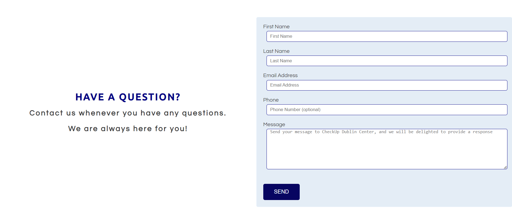
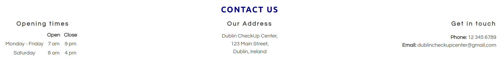
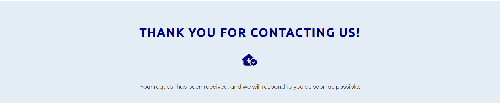

# CheckUp Dublin Center

Welcome to the CheckUp Dublin Center repository! This website serves as an immersive online platform dedicated to delivering essential health information and services to the residents of Dublin.

The goal of the CheckUp Dublin Center website is to provide a virtual clinic experience that offers a thorough health screening checkup, with a focus on preventive medicine. This checkup includes a full physical examination, various medical tests, and advanced exams, all conveniently available at a single location. Our primary aim is to prioritize the well-being and health of our patients by providing a comprehensive and convenient healthcare solution. 

[View CheckUp Dublin Center Website](https://izabellalopes.github.io/checkup-dublin/)

## CONTENTS

* [Design](#Design)
  * [Color Scheme](#Color-Scheme)
  * [Typography](#Typography)
  * [Imagery](#Imagery)
  * [Features](#Features)
  * [Features Left to Implement](#Features-Left-to-Implement)
  * [Accessibility](#Accessibility)

* [Technologies Used](#Technologies-Used)
  * [Languages Used](#Languages-Used)
  * [Frameworks, Libraries & Programs Used](#Frameworks-Libraries--Programs-Used)

* [Deployment](#Deployment)

* [Testing and Solved Bugs](#Testing-and-solved-bugs)
  * [Validator Testing](#Validator-Testing)
  * [Lighthouse](#Lighthouse)
  * [Full Testing](#Full-Testing)
  
* [Credits](#Credits)
  * [Code Used](#Code-Used)
  * [Content](#Content)
  * [Media](#Media)
  * [Acknowledgments](#Acknowledgments)

- - -

## Design

### Color Scheme

The choice of colors plays a crucial role in shaping the overall perception of professionalism, trustworthiness, and clarity when creating a website for CheckUp Dublin Center.

The gentle blues establish an atmosphere of calmness and hospitality, while the grays and deeper blues introduce contrast and structure.

The color palette was created using the [Coolors](https://coolors.co/) website.

### Typography

Google Fonts was used for the following fonts: 

- Ubuntu for Titles:
  -  Sans-serif font
  -  Professional and modern appearance

- Questrial for Body:
  -  Sans-serif font
  -  Clean and elegant design, that provides pleasant reading experience

### Imagery

The website features a captivating array of imagery sourced from iStock, Lexica, and Unsplash, offering a diverse selection of high-quality visuals. To honor the sources of these remarkable images, proper credits have been given in the dedicated [credits](#Credits) section.

### Features 

The website consists of five pages, with four of them accessible through the navigation menu: the home page, the about CheckUp Dublin Center page, the services page, and the contact us page. The fifth page is a thank you page that appears after a user submits the form on the contact us page.

#### Existing Features

Every page on the website has:

- __Navigation Bar__

  - At the top of the website, there is a fully responsive navigation bar that is featured on all four pages. It includes links to the Logo, Home page, About CheckUp Dublin Center, Services, and Contact us page. It remains consistent across all pages, making navigation effortless.
  - This section enables users to navigate easily between pages on all devices without the need to rely on the 'back' button to go to the previous page. 

- __Footer__ 

  - The footer section includes links to the relevant social media sites for CheckUp Dublin Center. The links will open in a new tab, providing a seamless navigation experience for the user. 
  - Icons were used to maintain a clean footer and because they are universally recognizable.

#### Home page

- __The landing page image__

  - The landing page features a captivating background image with overlaid text showcasing a detailed view of a stethoscope alongside a digital tablet exhibiting a virtual electronic medical record interface. By using the stethoscope as a symbol of traditional medical expertise and the digital tablet as a depiction of our modern tools and systems, we aim to blend the most exceptional elements from both domains, providing a comprehensive patient experience that addresses their overall well-being.
  - This section additionally captivates the user's attention by introducing the CheckUp Dublin Center with an eye catching animation, designed to immediately seize their interest.

- __About us section__

  - The About us section will provide a concise overview of the center's services, expertise, and commitment to delivering exceptional healthcare.  It aims to inform visitors about the center's mission, values, and the cutting-edge medical services it offers. 
  - Additionally, at the end of the section, there is a button labeled "Learn More" that directs users to the dedicated page providing detailed information About CheckUp Dublin Center.

- __Our Services section__

  -  This section aims to provide visitors with a succinct overview of the comprehensive range of services available at CheckUp Dublin Center. It highlights key offerings such as full physical examinations for preventive care, clinical investigations, and a variety of exams including ultrasound scans, DXA scans, chest X-rays, resting electrocardiograms, and ergometric tests. 
  - Additionally, at the end of the section, there is a button labeled "Check our services" that takes users directly to the Services page.

- __Testimonials section__

  -  The purpose of the "Testimonials" section is to showcase positive feedback and testimonials about the center's services. While the patients and experiences may be fictional, the testimonials aim to create a sense of trust and credibility by highlighting the positive experiences of supposed patients.
  -  By including these testimonials, the section aims to build confidence and encourage potential patients to choose CheckUp Dublin Center for their healthcare needs.

#### About CheckUp Dublin Center page

- __Welcome section__

  -  The welcome section is to invite visitors to enter CheckUp Dublin Center and embark on a journey towards improved vitality and wellness. The section highlights the proficiency of the center's team, who are equipped with modern equipment and possess extensive experience to provide exceptional care. 

- __Our Team section__

  -  The "Our Team" section aims to highlight the expertise and dedication of the healthcare professionals and reassure patients that they will receive exceptional care from a well-rounded and skilled team.
  -  The inclusion of four photos, representing a fictitious medical doctor (GP), a medical doctor (radiologist), a medical manager, and a nurse, adds a visual element to help visitors connect with the team members and further instill trust in their abilities to deliver top-notch care. 

#### Services

- __Services section__

  -  The section aims to inform visitors about the extensive range of services available, ensuring they understand the diverse healthcare options provided.
  -  The section highlights a wide range of complete checkups, covering areas such as cardiovascular, respiratory, abdominal, nervous system, vision, and hearing. It also includes specialized services like gynecology and mastology for females and prostate examinations for males. Additionally, lifestyle and nutritional assessments, postural assessments, clinical investigations (including blood tests and urinalysis), and various exams such as ultrasound scans, DXA scans, chest X-rays, resting electrocardiograms, and ergometric tests are offered.
  -  Additionally, at the end of the section, there is a button labeled "Schedule your Checkup now" that takes users directly to the Contact us page.

- __Gallery section__

  -  The purpose of the gallery featuring eight photos on the CheckUp Dublin Center website is to visually showcase different aspects of the center, providing visitors with a glimpse into the facilities, services, and patient experience. The selected photos aim to create a positive impression, highlighting the modern and welcoming environment, state-of-the-art equipment, friendly staff, and patient-centered care.
  

#### Contact us page

- __Form section__

  -  The purpose of the form section is to provide visitors with a convenient and accessible means of reaching out to CheckUp Dublin Center for any questions or inquiries they may have.
  -  The page encourages visitors to utilize the provided contact form, which typically includes fields for entering their first name, last name, email address, phone number, and a message. 

- __Contact section__

  -  The aim is to provide visitors with essential information to connect with CheckUp Dublin Center. It includes details such as the center's opening times on weekdays (Monday to Friday) and Saturdays, a fictitious address and contact details like the phone number and email address. 
 

- __Map section__

  -  The map serves the purpose of enhancing accessibility by assisting visitors in virtually locating the CheckUp Dublin Center.

#### Thank you page

- __Thank you section__

  -  A thank you page serves as a confirmation and appreciation message to users who have submitted a form. It acknowledges their action and expresses gratitude for their participation. 
 

### Features Left to Implement

- Create a Hamburger menu to improve readability on small screen devices.
- Health Blog: Incorporate a health blog on the website to provide valuable information, tips, and articles on various health topics, promoting education and engagement with visitors.

### Accessibility

I have been attentive to make the website as accessible-friendly as possible through the following measures:

* Utilizing semantic HTML to provide meaningful structure and enhance accessibility.
* Incorporating descriptive alt attributes for images on the site to provide alternative text for screen readers.
* Ensuring an adequate color contrast across the site to improve readability for users with visual impairments. I employed the contrast checker provided by [WebAIM](https://webaim.org/resources/contrastchecker/) to validate the contrast ratio between the selected foreground color and background color.
* Making menus accessible by indicating the current page as "current" for screen readers, aiding navigation and orientation.

By implementing these considerations, I have strived to enhance the overall accessibility of the website.

- - -

## Technologies Used

### Languages Used

This website was created using HTML and CSS.

### Frameworks, Libraries & Programs Used

Visual Studio Code - Initially, I began drafting my project using VS Code, version 1.79.0, as I encountered technical issues with Codeanywhere, which had an initialization bug. However, once the bug in Codeanywhere was resolved, I initiated a new project and proceeded to rewrite all of my project code.

Codeanywhere - I used Codeanywhere as my official Code Editor for the project. On June 10th 2023, I encountered an issue where I had exceeded my usage hours and my subscription had expired. To resolve this, I reached out to the tutor support, and Sarah kindly provided me with an invitation link. Fortunately, since I had already pushed my commits, the transition to Code Institute's team went smoothly.

Github - To save and store the files for the website.

Google Fonts - To import the fonts used on the website.

Font Awesome - For the iconography on the website.

Google Maps- For the virtual map on the Contact us page.

Google Dev Tools - To troubleshoot and test features, resolve issues related to responsiveness and styling.

[Tiny PNG](https://tinypng.com/) To compress images.

[Safeimagekit](https://safeimagekit.com/) To resize images and convert them to the webp format.

[Am I Responsive?](http://ami.responsivedesign.is/) To display the website image across various devices.

- - -

## Deployment

- The site was deployed to GitHub pages. The steps to deploy are as follows: 
   - Sign in to your GitHub account.
   - Locate the repository named "checkup-dublin" for this project.
   - Click on the "Settings" link.
   - In the left-hand side navigation bar, click on "Pages".
   - In the "Source" section, choose "main" from the branch selection dropdown menu. Select "Root" from the folder selection dropdown menu.
   - Click on "Save." Your GitHub Pages site is now deployed and can be accessed at the displayed URL.

The live link can be found here - [CheckUp Dublin Center](https://izabellalopes.github.io/checkup-dublin/)  

- - -

## Testing and Solved Bugs

Testing was conducted consistently throughout the website development process to ensure its functionality. Chrome developer tools were utilized to identify and troubleshoot any issues that arose during the build.

During the mid-project meeting with my mentor, we discussed and addressed specific issues that were identified:

- The responsive design of the landing page image for small screen sizes (650px wide and below) had an issue where the right border of the cover text would disappear from the screen. However, this problem was successfully resolved after my mentor suggested including a percentage-based property (1%) for the class "cover-text" and it worked perfectly.
- The testimonials section had an issue with its responsive design, where the image and text were overlapping in medium-sized screens. Initially, I had configured the code using the "float: left" property. However, my mentor suggested changing the CSS approach by using the "display: grid" property. Initially, the grid had four columns, but for medium-sized screens, it was changed to two columns, and for small-sized screens, it was changed to one column. This adjustment resolved the issue, and the responsive design now functions perfectly.
- The responsive design of the welcome section needed improvement as the welcome image was becoming smaller, and the text and image were positioned side by side in small screen sizes. To address this issue, I made the following changes: Replaced the initial code, which used "display: flex," with "display: grid" to achieve better results. Then, I modified the code by setting "grid-template-columns: 1fr" for screen sizes ranging from 900px wide and below. These adjustments were successful in achieving the desired outcome, improving the responsive design of the welcome section.
- A similar issue was promptly resolved in the "Our Team" images by changing the initial code from "display: flex" to "display: grid." This simple modification allowed me to configure the images initially with 4 columns and adjust them to 2 columns for larger to medium screen sizes in the responsive design. Additionally, for small screen sizes, the images were adjusted to display in a single column. This modification successfully addressed the issue and improved the responsive design of the "Our Team" section.
- To enhance the responsiveness of the "Our Services" section on the services page, I made the following changes: Instead of using "display: flex" with a flex-basis of 30% for the IDs "complete-checkup," "clinical-investigations," and "exams," I switched to "display: grid" with three template columns initially set as "1fr 1fr 1fr." For medium-sized screens, I modified it to have a single column with a width of "1fr." By implementing these adjustments, the "Our Services" section now adapts better to different screen sizes, improving its responsiveness.

Other issues that has been resolved:

- Lighthouse identified that the link labeled "Learn More" in the "About Us" section of the homepage did not have descriptive text. To address this issue, I replaced the generic phrase "Learn More" with the specific description "Know more about us." This modification enhances the SEO from a score of 90 to 100.
- Lighthouse verified that the iframe element within the map section does not have a title. To address this issue, I included a descriptive title for the frame to describe the map.

### Validator Testing 

- HTML
  - No errors were returned when passing through the official [W3C validator](https://validator.w3.org/nu/?doc=https%3A%2F%2Fcode-institute-org.github.io%2Flove-running-2.0%2Findex.html)
- CSS
  - No errors were found when passing through the official [(Jigsaw) validator](https://jigsaw.w3.org/css-validator/validator?uri=https%3A%2F%2Fvalidator.w3.org%2Fnu%2F%3Fdoc%3Dhttps%253A%252F%252Fcode-institute-org.github.io%252Flove-running-2.0%252Findex.html&profile=css3svg&usermedium=all&warning=1&vextwarning=&lang=en#css)

### Lighthouse

I utilized Lighthouse, a tool available in the Chrome Developer Tools, to assess the performance, accessibility, best practices, and SEO aspects of the website.

#### Home page

#### About Checkup Dublin Center page

#### Services page

#### Contact us page

#### Thank you page

### Full Testing

To make sure my website works properly, I tested it on different web browsers like Google Chrome and Microsoft Edge, and also on different devices such as a Dell Inspiron 15-inch laptop and a Samsung A52S smartphone.

Additionally, I inspected each page using Google Chrome Developer Tools to ensure that they appeared correctly and were responsive on various screen sizes.

Links:

- I conducted link testing on the index page, about us page, services page, contact us page, and thank you page. During the testing, it was confirmed that all the links on these pages operated as expected. Additionally, any links that directed to external pages successfully opened in separate browser tabs.

Contact Us Form:

1. The contact us form was tested by submitting it without filling in any input fields. The form correctly prompted the user to fill in the First Name field. After filling in the first name and submitting the form, the form directed the user to fill out the Last Name field. Upon completing the last name and submitting the form, the user was prompted to fill in the Email field. Finally, after filling in the first name, last name and email, the form successfully submitted and opened the thank you page in the same browser window, considering the phone number and message fields as optional.
2. A test was performed by submitting the form with only the email address. The form correctly directed the user to fill in the First Name field. After providing the first name and email, the form prompted the user to fill out the Last Name field. Upon completing the first name, last name, and email, the form successfully submitted and opened the thank you page in the same browser window.
3. Another test was conducted by submitting the form with only the message field filled in. The form correctly directed the user to fill in the First Name field and then the Last Name field. After providing the first name, last name, and message, the form prompted the user to fill in the email field. Finally, after filling in the first name, last name, email, and message, the form successfully submitted and opened the thank you page in the same browser window.

- - -

## Credits 

### Code Used

- [LoveRunning source code from Code Institute](https://github.com/Code-Institute-Solutions/love-running-2.0-sourcecode)
- [README.md template from Code Institute](https://github.com/Code-Institute-Solutions/readme-template)
- [README.md examples from kera-cudmore](https://github.com/kera-cudmore/readme-examples/tree/main)
- [Bully-Book-Club from kera-cudmore](https://github.com/kera-cudmore/Bully-Book-Club)

### Content 

- Content for the website was written by Izabella Lopes.
- The About section for CheckUp Dublin Center's homepage and welcome section has been rewritten with the assistance of [ChatGPT](https://chat.openai.com/), an AI language model developed by OpenAI.
- The icons in the footer were taken from [Font Awesome](https://fontawesome.com/).

### Media

 Home page:
 
- Background
    - [hero-image](https://www.istockphoto.com/photo/close-up-of-a-stethoscope-and-digital-tablet-with-virtual-electronic-medical-record-gm1369987284-439639988?phrase=medicine+background) - Credit to everything possible, iStock.
 
- Our services
    - [complete checkup](https://www.istockphoto.com/photo/doctor-writing-a-medical-prescription-gm1319031310-405998329?phrase=physical+examination) - Credit to demaerre, iStock. 
    - [clinical investigations](https://www.istockphoto.com/photo/professional-doctor-preparing-patient-for-procedure-gm627290560-111071371?phrase=Clinical+investigations) - Credit to YakobchukOlena, iStock
    - [exams](https://www.istockphoto.com/photo/detail-of-computer-ultrasound-with-x-ray-in-modern-medicine-gm941578476-257350996?phrase=ultrasound+device) - Credit to Vladimir_Timofeev, iStock.
 
- Testimonials
    - [testimonial-1](https://lexica.art/prompt/a2c059db-d517-4f22-ae91-cbaa919a63ee) - Credit to Lexica.
    - [testimonial-2](https://lexica.art/prompt/9edb0923-b474-4c74-b11b-28d9f889714d) - Credit to Lexica.
    - [testimonial-3](https://lexica.art/prompt/cc910fc1-bde8-4df2-98e8-587ccd41bb56) - Credit to Lexica.
    - [testimonial-4](https://lexica.art/prompt/0175a75b-41b8-4024-89af-492bde6523bf) - Credit to Lexica. 

About CheckUp Dublin Center page:

- Welcome
    - [welcome](https://www.istockphoto.com/photo/reception-and-armchairs-in-hospital-hall-gm1223999858-359731228?phrase=clinic%2Breception%2Bdesk) - Credit to ismagilov, iStock.

- Our Team
    - [our-team-1](https://lexica.art/prompt/7c2c4250-0675-4b96-b507-47a96905968e) - Credit to Lexica.
    - [our-team-2](https://lexica.art/prompt/7bd0447d-9020-4137-94a9-9489eb117e96) - Credit to Lexica.
    - [our-team-3](https://lexica.art/prompt/ed4d8873-e9a7-49e0-a411-1fd7d976040d) - Credit to Lexica.
    - [our-team-4](https://lexica.art/prompt/c01b134c-472b-4425-a353-d8da33843866) - Credit to Lexica.

Services page:

- Gallery
    - [gallery-1](https://lexica.art/prompt/0decd297-34db-4af5-99e9-441292db1824) - Credit to Lexica.
    - [gallery-2](https://www.istockphoto.com/photo/nurse-and-doctor-team-meeting-collaboration-gm1272197465-374537275) - Credit to AndreyPopov, iStock.
    - [gallery-3](https://unsplash.com/pt-br/fotografias/Y-3Dt0us7e0) - Credit to Patty Brito, Unsplash.
    - [gallery-4](https://www.istockphoto.com/photo/elderly-patient-with-bp-heart-rate-digital-pulse-check-equipment-for-medical-gm1177942982-329043762) - Credit to Chinnapong, iStock.
    - [gallery-5](https://www.istockphoto.com/photo/making-ultrasound-check-up-gm895702826-247446807) - Credit to shironosov, iStock.
    - [gallery-6](https://www.istockphoto.com/photo/bone-density-hip-and-lumbarspine-result-osteoporosis-gm1165489459-320715536) - Credit to Tonpor Kasa, iStock.
    - [gallery-7](https://www.istockphoto.com/photo/young-caucasian-man-standing-against-wall-while-doctor-using-x-ray-machine-scan-him-gm1266813630-371478609?phrase=chest+xray) - Credit to Inside Creative House, iStock.
    - [gallery-8](https://unsplash.com/pt-br/fotografias/QsBfOwMoPNY) - Credit to Towfiqu barbhuiya, Unsplash. 

### Acknowledgments

I would like to acknowledge the following individuals who helped me along the way in completing my first milestone project:

- My family, for their strong support during my transition and development of a new career. Their names are featured in the testimonials and our team section of the CheckUp Dublin Center webpage as a way to honor them and show my appreciation.
- Jubril Akolade, my Code Institute Mentor, for providing valuable advice.
